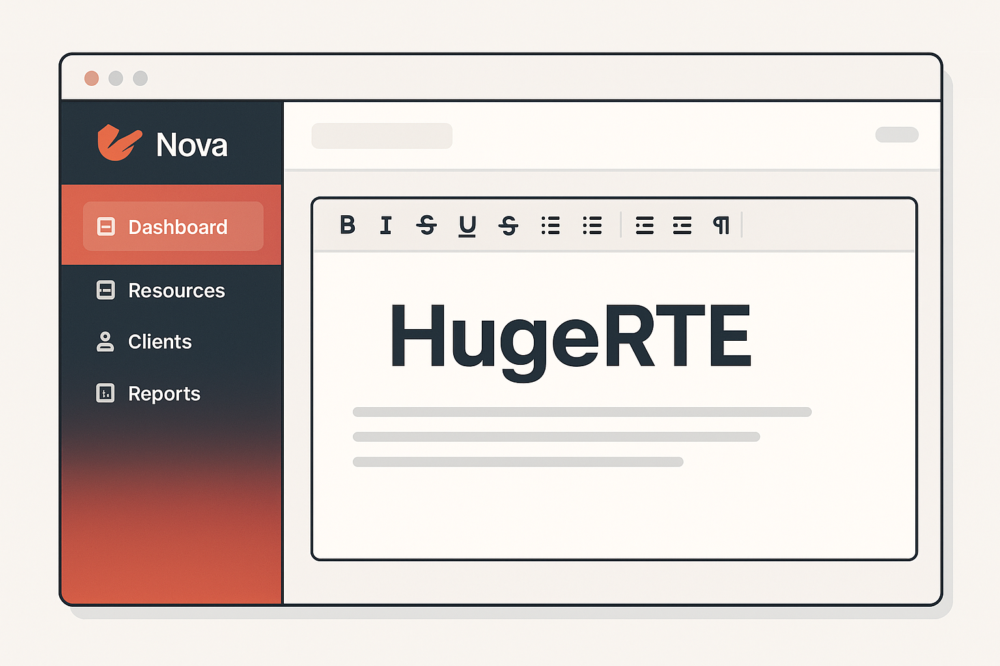
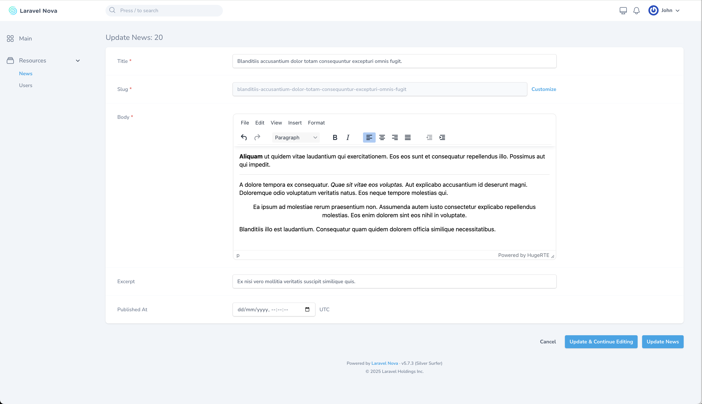
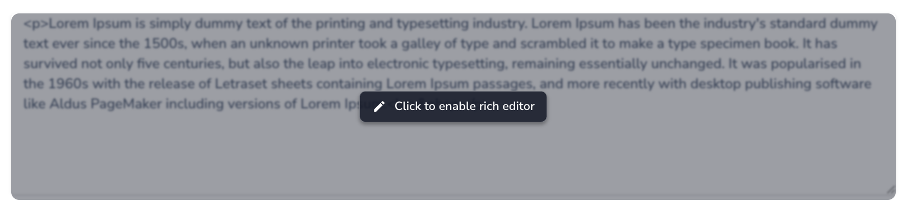

# Nova HugeRTE Editor



## Introduction

Based on [murdercode/Nova4-TinymceEditor](https://github.com/murdercode/Nova4-TinymceEditor), 
**HugeRTE** is a license-free rich text editor field for Laravel Nova.

## Screenshots

### Active Editor
Once activated, the full TinyMCE-based HugeRTE editor mounts in place.  


### Lazy Mode
Editor loads only when clicked, improving performance on forms with many editors.  


## Features
- **Lazy loading support** (configurable) → improves performance by mounting editors only on demand.
- Click-to-enable overlay with smooth transition.
- Dark mode support (auto or manual).
- Configurable TinyMCE `init`, `plugins`, and `toolbar` options.
- Can be disabled via `readonly()`.

## Prerequisites
- Laravel >= 9
- PHP >= 8.0
- Laravel Nova >= 5

## Installation

composer require pekhota/nova-hugerte

Then publish the config:

php artisan vendor:publish --provider="Pekhota\NovaHugeRTE\FieldServiceProvider"

This will create `config/nova-hugerte.php`:

```php
<?php

return [
    /**
     * Default skin to use.
     */
    'skin' => 'oxide-dark',

    /**
     * Whether to enable lazy mode by default.
     * Lazy mode shows a textarea with overlay until activated,
     * reducing initial page load when multiple editors are present.
     */
    'lazy' => false,

    /**
     * HugeRTE init options.
     * The default options to send to the editor.
     * See https://github.com/hugerte/hugerte and https://www.tiny.cloud/docs/configure/ 
     * for all available options.
     */
    'init' => [
        'menubar' => false,
        'autoresize_bottom_margin' => 40,
        'branding' => false,
        'image_caption' => true,
        'paste_as_text' => true,
        'autosave_interval' => '20s',
        'autosave_retention' => '30m',
        'browser_spellcheck' => true,
        'contextmenu' => false,
    ],
    'plugins' => [
        'advlist',
        'anchor',
        'autolink',
        'autosave',
        'fullscreen',
        'lists',
        'link',
        'image',
        'media',
        'table',
        'code',
        'wordcount',
        'autoresize',
    ],
    'toolbar' => [
        'undo redo restoredraft | h2 h3 h4 |
         bold italic underline strikethrough blockquote removeformat |
         align bullist numlist outdent indent | image link anchor table |
         code fullscreen spoiler',
    ],
];
```

## Usage

In your `Nova/Resource.php` add the field:

```php
<?php

use Pekhota\NovaHugeRTE\HugeRTE;

class Article extends Resource
{
    public function fields(NovaRequest $request)
    {
        return [
            HugeRTE::make(__('Content'), 'content')
                ->rules(['required', 'min:20'])
                ->fullWidth()
                ->help(__('The content of the article.')),
        ];
    }
}
```

## Lazy vs Eager Mode

- **Eager mode (default):** Always mount the editor immediately:
- **Lazy mode:** Shows a textarea with overlay until clicked. Best for performance with many fields. To enable, 
set in config

```php
'lazy' => true,
```

or per field

```php
HugeRTE::make('Content')->withMeta(['options' => ['lazy' => true]]);
```
